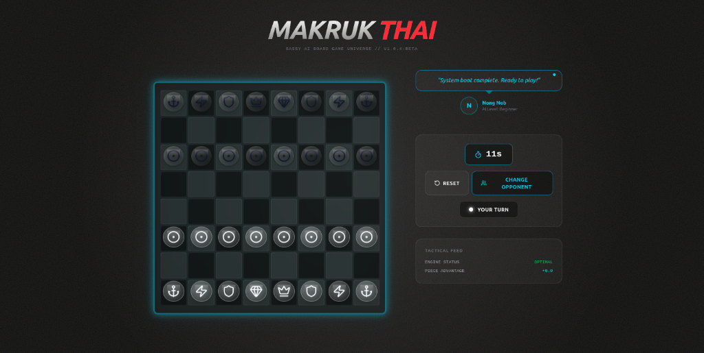

# 🚀 Makruk Thai: Sassy AI Board Game Universe



Experience the traditional Thai Board Game (**Makruk**) like never before. Immerse yourself in a **Cyberpunk Glassmorphism** interface featuring hyper-intelligent, sassy AI personalities.


## ✨ Core Features

### 🕶️ Cyberpunk Glassmorphism UI
*   **Deep Glass Frame**: High-contrast board design with thick neon borders.
*   **Translucent Pieces**: 3D glass pieces with glowing internal cores.
*   **Dynamic Theming**: The entire UI color palette shifts based on your selected opponent.
*   **Micro-Animations**: Continuous scan lines, pulsing neon perimeters, and floating piece animations.

### 🤖 4 Levels of Sassy AI
Face off against personalities that react to your every move:
1.  **Nong Nob (Cyan)**: Beginner Level. A polite but clumsy robot learning the ropes.
2.  **Pro Kao (Amber)**: Intermediate Level. A tactical strategist who calculates your doom.
3.  **Master Meow (Purple)**: Advanced Level. A sassy feline grandmaster who judges your skills.
4.  **Thunder God (Red)**: Champion Level. Intense neon wrath and high-contrast arrogance.

### 🐘 Thai Makruk Rules
*   Complete implementation of **Makruk engine**.
*   Traditional setup with **Bia** (Pawns) on the 3rd rank.
*   Thai-specific pieces: **Khun** (King), **Met** (Queen), **Khon** (Noble), **Ma** (Horse), **Ruea** (Boat).
*   Correct promotion logic (Bia-Ngai).

## 🛠️ Tech Stack
*   **Frontend**: [Next.js](https://nextjs.org/) (App Router)
*   **Styling**: [Tailwind CSS](https://tailwindcss.com/)
*   **Animations**: [Framer Motion](https://www.framer.com/motion/)
*   **Icons**: [Lucide React](https://lucide.dev/)
*   **Audio**: Web Audio API (No external assets required)

## 🚀 Getting Started

1.  **Install Dependencies**:
    ```bash
    npm install
    ```

2.  **Run Development Server**:
    ```bash
    npm run dev
    ```

3.  **Open in Browser**:
    Navigate to `http://localhost:3000` (or the port shown in your terminal).

## 🎮 How to Play
1.  Select your opponent from the selection screen.
2.  Move your white pieces (bottom) to strategically overcome the AI.
3.  Enjoy the sassy taunts in the AI chat box above the controller.

---
*Created with ❤️ by Antigravity AI for the Insurgent-Dev community.*
